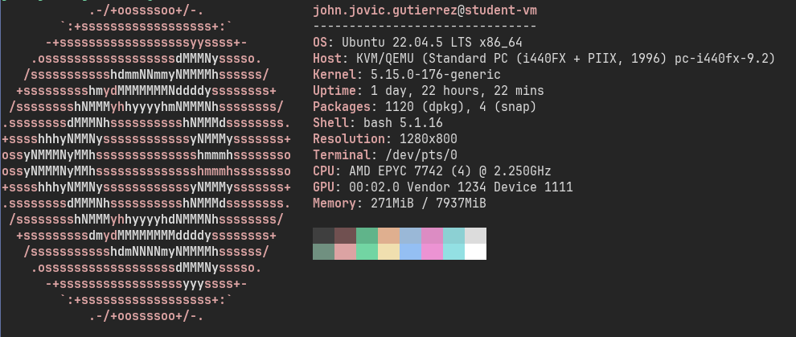

# Capstone Exercise Part I: Optimizing 2D Image Convolution using SIMD

**Name**: John Jovic A. Gutierrez \
**SN**: 2022-07198
**Date**: 

Laplacian Edge Detection 3x3 Kernel
Using [Moore Neighborhood](https://en.wikipedia.org/wiki/Moore_neighborhood)

## I. Introduction
### A. Setup
As instructed, the benchmarks are done within the EEEI Virtual Machines in order for the performance results obtained under a controlled and consistent setup. 



output of `lscpu`:
L1d:
L2:
L3:

### B. Sample Test Inputs
I infer and collected images from Guennadi Levkine's [webiste](https://www.hlevkin.com/hlevkin/06testimages.htm), specifically the planets and the Sun of the Solar System (from NASA). I also collected the Lena picture and a friend's cat.

I used `ffmpeg` with the following parameters in order to convert the various sample image file formats to the desired **24-bit bitmap** input: 

`ffmpeg -i input.png -pix_fmt rgb24 output.bmp`

To check, we can use the `file` command to check if we have the right **24-bit bitmap file**. As such, the command `file input.bmp` should give the dimensions, then an indicator for the bit size per pixel, in this case 24.

```
output.bmp: PC bitmap, Windows 3.x format, 684 x 1034 x 24 ...
```

###

## II. Code Implementation

Compiled with and without comppiler optimizations, i.e. `-O3`


## III. Benchmark Performance 


References:
---
- [Laplacian Edge Detection](https://dsp.stackexchange.com/questions/60618/why-are-there-two-different-common-3-times-3-kernels-for-the-laplacian)

- [Image Kernels](https://setosa.io/ev/image-kernels/)